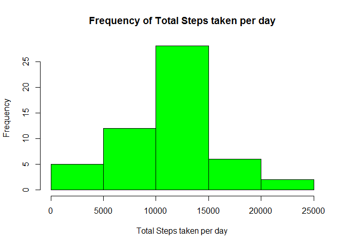
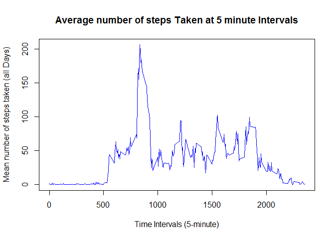

##Reproductible Research : Peer Assignment 1

It is now possible to collect a large amount of data about personal movement using activity monitoring devices such as a Fitbit, Nike Fuelband, or Jawbone Up. These type of devices are part of the "quantified self" movement - a group of enthusiasts who take measurements about themselves regularly to improve their health, to find patterns in their behavior, or because they are tech geeks. But these data remain under-utilized both because the raw data are hard to obtain and there is a lack of statistical methods and software for processing and interpreting the data.

This assignment makes use of data from a personal activity monitoring device. This device collects data at 5 minute intervals through out the day. The data consists of two months of data from an anonymous individual collected during the months of October and November, 2012 and include the number of steps taken in 5 minute intervals each day.

###Loading and preprocessing the data


```r
activitydata <- read.csv("activity.csv")
```

###What is mean total number of steps taken per day?


Calculate the total number of steps taken per day :


```r
nbSteps <- aggregate(steps ~ date, data = activitydata, sum, na.rm = TRUE)
print(nbSteps)
```

```
##          date steps
## 1  2012-10-02   126
## 2  2012-10-03 11352
## 3  2012-10-04 12116
## 4  2012-10-05 13294
## 5  2012-10-06 15420
## 6  2012-10-07 11015
## 7  2012-10-09 12811
## 8  2012-10-10  9900
## 9  2012-10-11 10304
## 10 2012-10-12 17382
## 11 2012-10-13 12426
## 12 2012-10-14 15098
## 13 2012-10-15 10139
## 14 2012-10-16 15084
## 15 2012-10-17 13452
## 16 2012-10-18 10056
## 17 2012-10-19 11829
## 18 2012-10-20 10395
## 19 2012-10-21  8821
## 20 2012-10-22 13460
## 21 2012-10-23  8918
## 22 2012-10-24  8355
## 23 2012-10-25  2492
## 24 2012-10-26  6778
## 25 2012-10-27 10119
## 26 2012-10-28 11458
## 27 2012-10-29  5018
## 28 2012-10-30  9819
## 29 2012-10-31 15414
## 30 2012-11-02 10600
## 31 2012-11-03 10571
## 32 2012-11-05 10439
## 33 2012-11-06  8334
## 34 2012-11-07 12883
## 35 2012-11-08  3219
## 36 2012-11-11 12608
## 37 2012-11-12 10765
## 38 2012-11-13  7336
## 39 2012-11-15    41
## 40 2012-11-16  5441
## 41 2012-11-17 14339
## 42 2012-11-18 15110
## 43 2012-11-19  8841
## 44 2012-11-20  4472
## 45 2012-11-21 12787
## 46 2012-11-22 20427
## 47 2012-11-23 21194
## 48 2012-11-24 14478
## 49 2012-11-25 11834
## 50 2012-11-26 11162
## 51 2012-11-27 13646
## 52 2012-11-28 10183
## 53 2012-11-29  7047
```

Make a histogram of the total number of steps taken each day


```r
hist(nbSteps$steps,col="green",main="Frequency of Total Steps taken per day",xlab="Total Steps taken per day",cex.axis=1,cex.lab = 1)
```

 


###Calculate and report the mean  of the total number of steps taken per day


```r
meanSteps <- mean(nbSteps$steps)
print(meanSteps)
```

```
## [1] 10766.19
```
The mean is 10766.19

###Calculate and report the median of the total number of steps taken per day


```r
medianSteps <- median(nbSteps$steps)
print(medianSteps)
```

```
## [1] 10765
```

The median is 10765

##What is the average daily activity pattern?

Make a time series plot (i.e. type = "l") of the 5-minute interval (x-axis) and the average number of steps taken, averaged across all days (y-axis)


```r
stepsInterval <- aggregate(steps ~ interval, data = activitydata, mean, na.rm = TRUE)
plot(steps ~ interval, data = stepsInterval, type = "l", xlab = "Time Intervals (5-minute)", ylab = "Mean number of steps taken (all Days)", main = "Average number of steps Taken at 5 minute Intervals",  col = "blue")
```

 

Which 5-minute interval, on average across all the days in the dataset, contains the maximum number of steps?


```r
maxStepInterval <- stepsInterval[which.max(stepsInterval$steps),"interval"]
print(maxStepInterval)
```

```
## [1] 835
```

The 5-minute Interval 835 contains the maximum number of steps

##Imputing missing values

Calculate and report the total number of missing values in the dataset


```r
missingValues <- sum(!complete.cases(activitydata))
print(missingValues)
```

```
## [1] 2304
```

The total number of missing values is 2304


